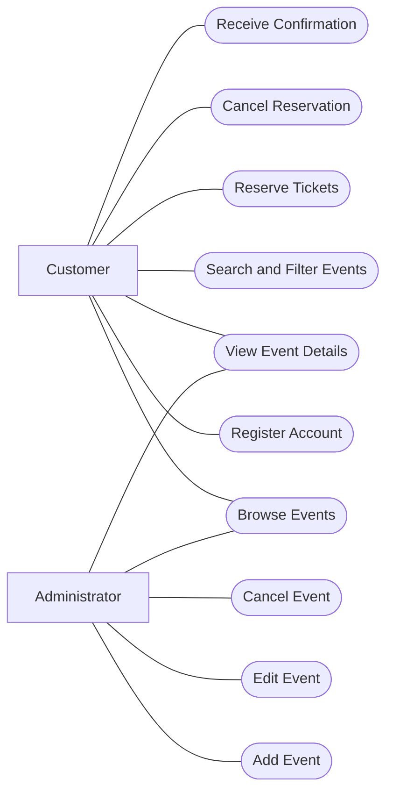
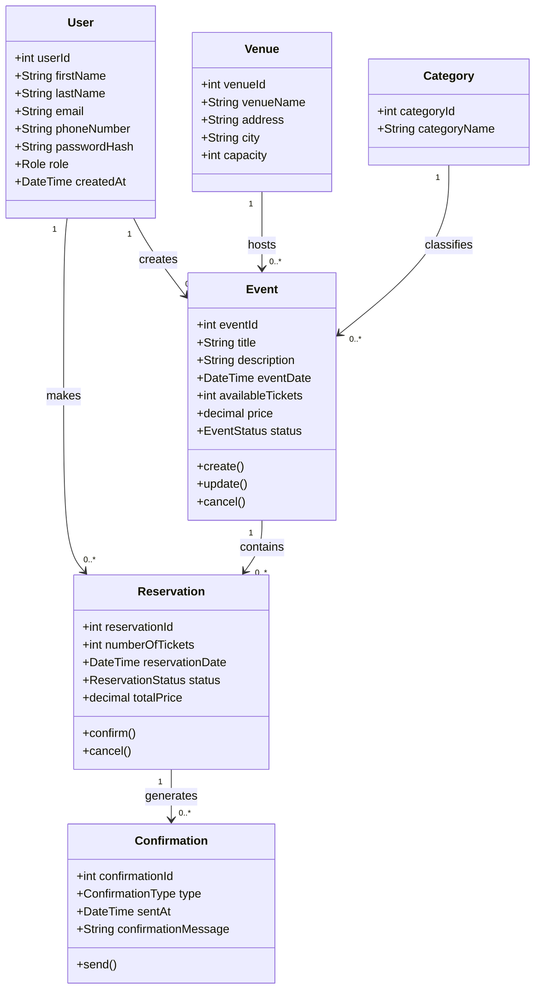
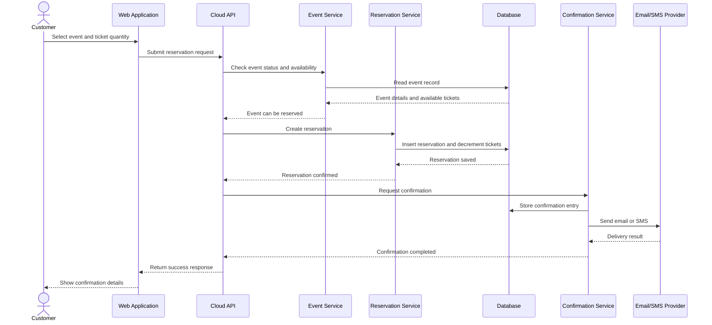
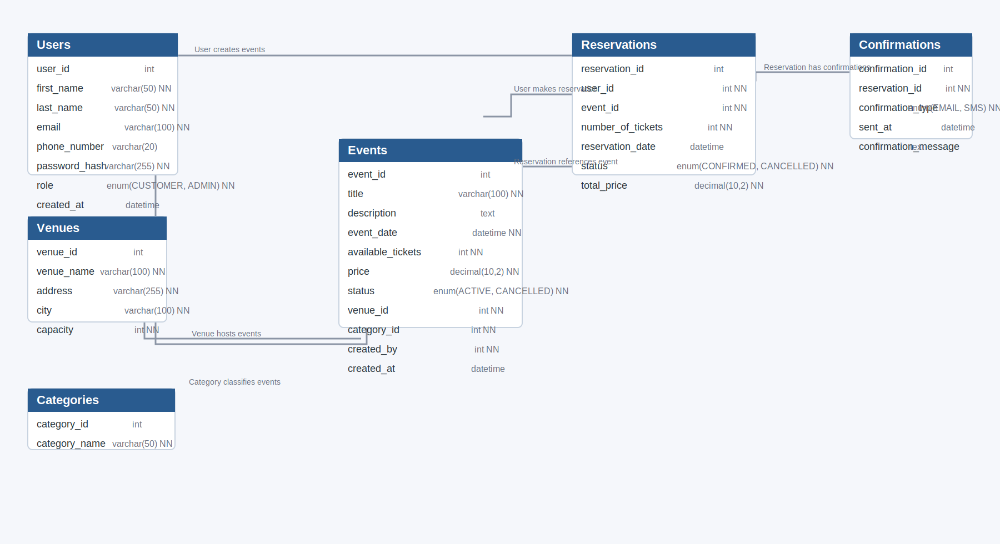
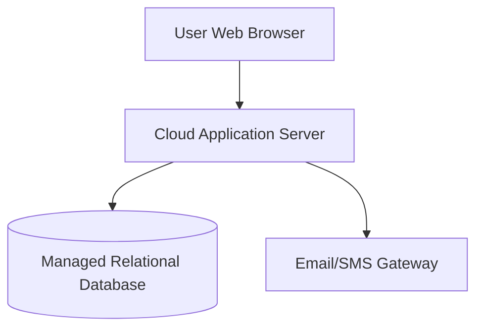

# System Architecture and Design

## 1. Purpose

This document presents the proposed architecture and design for the **Cloud-based Ticket Reservation Application**. It is based on the project README, the intended web-based delivery model for the project, and the database schema supplied in the project brief.

## 2. Architectural Overview

The system follows a **layered cloud architecture**:

- **Presentation layer**: browser-based web client for customers and administrators
- **Application layer**: cloud-hosted services that handle authentication, event management, reservations, and confirmations
- **Data layer**: relational database storing users, events, venues, categories, reservations, and confirmations
- **Integration layer**: external email/SMS services for digital confirmations

This structure supports the README requirements for concurrency, high availability, and a user-friendly interface.

## 3. High-Level Architecture Diagram

```mermaid
flowchart LR
    Customer[Customer]
    Admin[Administrator]
    App[Web Application]
    API[Cloud API / Application Services]
    Auth[Authentication Service]
    EventSvc[Event Management Service]
    ResSvc[Reservation Service]
    ConfirmSvc[Confirmation Service]
    DB[(Relational Database)]
    Notify[Email / SMS Provider]

    Customer --> App
    Admin --> App
    App --> API
    API --> Auth
    API --> EventSvc
    API --> ResSvc
    API --> ConfirmSvc
    Auth --> DB
    EventSvc --> DB
    ResSvc --> DB
    ConfirmSvc --> DB
    ConfirmSvc --> Notify
```

## 4. Main Components

| Component | Responsibility |
| --- | --- |
| Web Application | Provides pages for registration, browsing, search, reservation, cancellation, and admin event management |
| Authentication Service | Registers users, verifies credentials, and enforces role-based access |
| Event Management Service | Creates, updates, cancels, and retrieves event information |
| Reservation Service | Validates availability, creates reservations, updates ticket counts, and handles cancellations |
| Confirmation Service | Builds and records confirmation messages, then sends them by email or SMS |
| Relational Database | Stores all business entities and preserves transactional consistency |

## 5. Use Case View

## 6. Domain Class Diagram

## 7. Reservation Sequence Diagram

## 8. Database Design

The following ER diagram is the wiki-ready version of the provided database image.

### Entity Summary

| Entity | Purpose |
| --- | --- |
| Users | Stores customer and administrator identities |
| Venues | Stores physical event locations and capacities |
| Categories | Classifies events such as movie, concert, travel, or sports |
| Events | Stores the core event catalogue and availability information |
| Reservations | Records ticket bookings and their status |
| Confirmations | Stores confirmation messages sent for reservations |

### Key Relationships

- One user can create many reservations.
- One administrator can create many events.
- One venue can host many events.
- One category can classify many events.
- One event can have many reservations.
- One reservation can have one or more confirmation records.

## 9. Design Decisions

### Layered Separation

Separating the web client, services, and database improves maintainability and supports future testing and deployment changes.

### Relational Data Model

A relational schema fits the project well because reservations, events, and confirmations have clear relationships and transactional constraints.

### Role-Based Access

The `role` attribute on the user entity supports two main actor types: customer and administrator.

### Event Status Control

Using status fields such as `ACTIVE`, `CONFIRMED`, and `CANCELLED` simplifies business rules and auditing.

## 10. Deployment View

## 11. Risks and Mitigations

| Risk | Impact | Mitigation |
| --- | --- | --- |
| Concurrent reservations for the same event | Oversold tickets | Use transactional updates and availability checks in the reservation service |
| Notification service outage | Missing confirmations | Retry failed messages and keep confirmation records in the database |
| Incorrect admin edits | Bad event data or cancelled bookings | Enforce role checks and maintain audit timestamps |
| High demand near event release times | Slow response times | Scale cloud services horizontally and optimize event queries |

## 12. Conclusion

The proposed architecture supports the project's functional goals while addressing the README's non-functional expectations for concurrency, availability, and usability. The design also provides the UML and database views expected for a complete system architecture submission.
